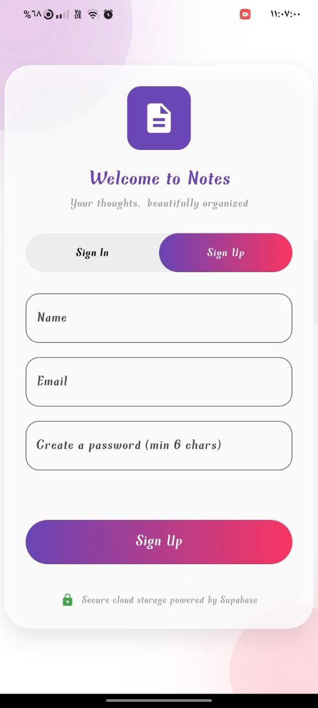
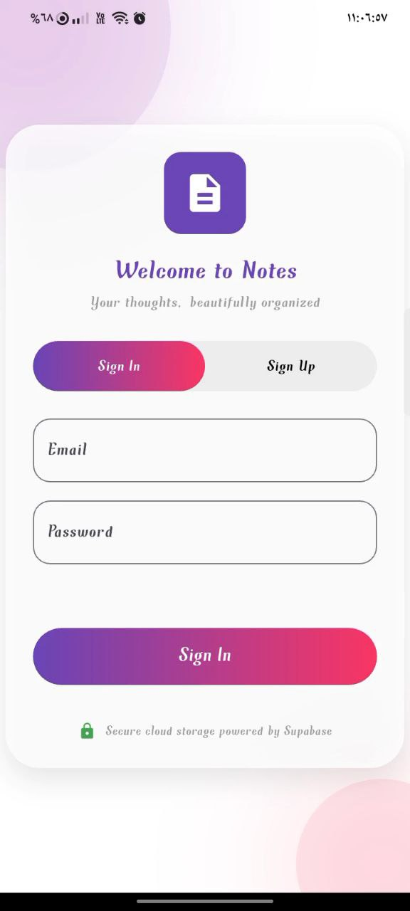
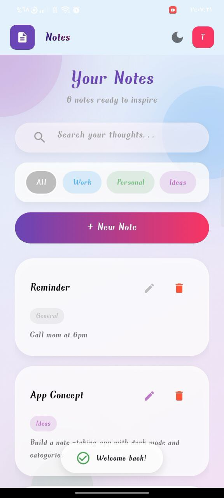
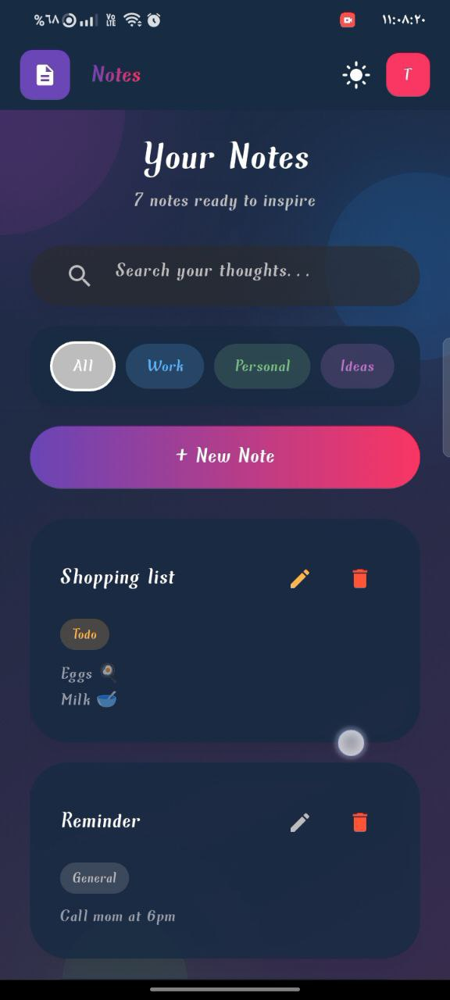
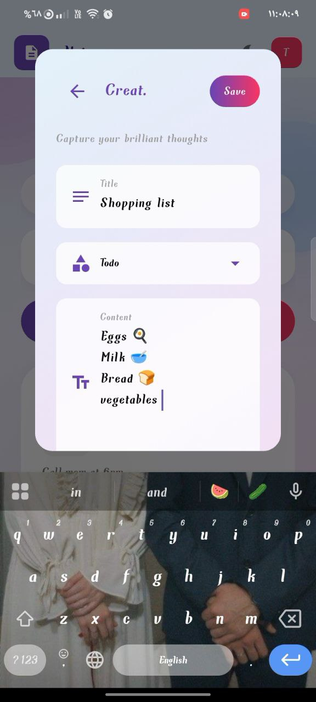

# Task 5: Notes App with Cloud Storage (Supabase)

## Overview
A Flutter notes app that allows users to sign up, log in, and manage notes stored in the cloud using Supabase. This app introduces authentication and cloud-based persistence.

## Features
- User authentication (sign up/login with email & password)  
- Add, edit, and delete notes  
- Notes persisted in Supabase cloud database  
- Real-time data retrieval on login  

### Bonus Features
- Search notes by title/content  
- Sort notes by date created/modified  
- Dark mode toggle  
- Offline caching of last synced notes  
- Tagging or categorization  

## Technologies Used
- Flutter widgets: ListView, TextField, ElevatedButton  
- Supabase Dart SDK for authentication and database  
- Optional: SharedPreferences for offline caching  

## Screenshots

## Status
✅ Completed
